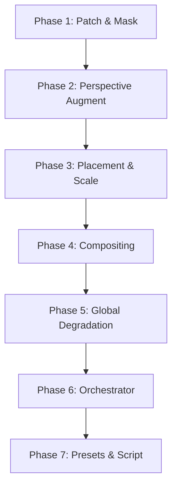

# Augmentation Pipeline — Phased Implementation Plan

> Derived from the sketch in `augmentation-pipeline.md` and refined through a
> grilling session. Each phase produces a human-testable or computer-testable
> deliverable. Phases are ordered by dependency; later phases depend on earlier
> ones.

## Status

| Phase | Name | State | Depends on |
|-------|------|-------|------------|
| 1 | QR Patch & Mask Generation | not-implemented | — |
| 2 | Perspective Augmentation | not-implemented | Phase 1 |
| 3 | Placement & Scale | not-implemented | Phase 2 |
| 4 | Compositing | not-implemented | Phase 3 |
| 5 | Global Degradation | not-implemented | Phase 4 |
| 6 | Pipeline Orchestrator | not-implemented | Phases 1–5 |
| 7 | Difficulty Presets & Script | not-implemented | Phase 6 |

## Design decisions (locked in grilling)

| # | Decision | Rationale |
|---|----------|-----------|
| 1 | Corners stored as `[x, y]` (OpenCV convention) | Matches `cv2.warpPerspective` / `homography.py` internals |
| 2 | Patch = QR + quiet zone rectangle; Mask = solid white rectangle (same dims) | Clean separation: patch for compositing, mask for feathering |
| 3 | Output: `corners_qr` in image-space `[x, y]`, no homographies | Detector ground truth only needs corners |
| 4 | Perspective via corner-jitter → compute homography → warp (on patch, pre-placement) | Atomic augmentation, no bounds checks needed at jitter stage |
| 5 | Pipeline order: **gen → augment → place → composite → global-degrade** | Augmentations happen on the isolated patch; placement is a simple scale+translate affine |
| 6 | Scale controlled by `pixels_per_module` range | Direct, intuitive, version-agnostic |
| 7 | Code lives in `src/qr_reader/synth/` | Follows existing detector/decoder subpackage pattern |
| 8 | Backgrounds used at native resolution | No distortion; avoids cropping decisions |
| 9 | Output: image files + single JSONL metadata file | Appendable, streamable, doesn't explode inode counts |
| 10 | Configuration via pydantic dataclass | Type-safe, serialisable, extendable |

## Coordinate systems

Three coordinate spaces appear in this pipeline:

| Space | Convention | Origin |
|-------|-----------|--------|
| **Patch space** | `(x, y)`, both 0-indexed from top-left of patch | Patch image top-left |
| **Warped-patch space** | `(x, y)`, same origin as patch space | Output of `cv2.warpPerspective` — a rectangular array |
| **Image space** | `(x, y)`, same as numpy `img[y, x]` | Background image top-left |

Corners flow: `patch-space → warped-patch-space → image-space` as they pass through
each homography/warp step.

## Data structures

### AugmentationConfig (pydantic)

```python
class AugmentationConfig(BaseModel):
    # QR code parameters
    version: int = 5                          # 1–40
    content: str = "QR Reader v1"
    error_correction: Literal["L", "M", "Q", "H"] = "M"  # ECL

    # Patch generation
    quiet_zone_modules: int = 4               # modules of quiet zone (QR spec minimum)
    ppm_range: tuple[float, float] = (3.0, 20.0)  # pixels per module

    # Augmentation — perspective jitter
    rotation_deg_range: tuple[float, float] = (0.0, 360.0)
    jitter_fraction: float = 0.15             # fraction of patch side length for corner jitter
    aspect_scale_range: tuple[float, float] = (0.8, 1.2)

    # Placement
    target_ppm_range: tuple[float, float] = (4.0, 12.0)  # ppm in final image

    # Feathering
    feather_sigma_range: tuple[float, float] = (0.5, 2.5)  # px

    # Global degradation (post-composite)
    blur_sigma_range: tuple[float, float] = (0.0, 1.5)
    noise_sigma_range: tuple[float, float] = (0.0, 8.0)
    jpeg_quality_range: tuple[int, int] = (50, 100)
```

### Metadata record (one JSONL line per sample)

```json
{
  "sample_index": 0,
  "seed": 42,
  "background_path": "data/images/train/living_room_1001.jpg",
  "payload": "QR Reader v1",
  "version": 5,
  "N": 37,
  "ecl": "M",
  "pixels_per_module": 7.4,
  "corners_qr": {
    "TL": [x, y],
    "TR": [x, y],
    "BR": [x, y],
    "BL": [x, y]
  },
  "augmentations": {
    "rotation_deg": 123.4,
    "jitter_fraction": 0.12,
    "aspect_scale": 0.93,
    "feather_sigma": 1.3,
    "blur_sigma": 0.7,
    "noise_sigma": 3.0,
    "jpeg_quality": 82
  }
}
```

---

## Phase 1 — QR Patch & Mask Generation

**Depends on:** nothing (standalone)  
**Files:** `src/qr_reader/synth/patch.py`  
**Tests:** `src/qr_reader/tests/synth/test_patch.py`

### 1.1 `generate_qr_patch(version, content, ecl_str, ppm, quiet_zone_modules) -> tuple[np.ndarray, np.ndarray]`

Generate a clean binary QR code with quiet zone.

1. Call `qrcode.QRCode(version=version, error_correction=ecl, box_size=ppm, border=quiet_zone_modules)`.
2. Render to a `uint8` image (values 0 and 255).
3. Convert black (0) and white (255) to a 3-channel RGB image.
4. Construct mask: `np.ones(patch.shape[:2], dtype=np.float32)` — solid white rectangle.

**Returns** `(patch_rgb: uint8[H, W, 3], mask: float32[H, W])`.

#### Tests

| Test | Verifies |
|------|----------|
| `test_patch_shape` | `patch_rgb.shape == (H, H, 3)` where `H = (N + 2*qz) * ppm` |
| `test_mask_all_ones` | `np.all(mask == 1.0)` |
| `test_module_count` | The QR code proper (excl. quiet zone) has N×N visible modules |
| `test_deterministic` | Same inputs → identical output |
| `test_version_bounds` | Versions 1, 7, 40 all produce valid output |
| `test_ecl_all` | All four ECLs produce valid output |

### 1.2 `compute_qr_corners_patch_space(quiet_zone_modules, N, ppm) -> np.ndarray`

Compute the 4 corners of the QR code proper (excluding quiet zone) in patch-space.

```
TL = (quiet_zone_modules * ppm, quiet_zone_modules * ppm)
TR = ((quiet_zone_modules + N) * ppm, quiet_zone_modules * ppm)
BR = ((quiet_zone_modules + N) * ppm, (quiet_zone_modules + N) * ppm)
BL = (quiet_zone_modules * ppm, (quiet_zone_modules + N) * ppm)
```

Returns `np.ndarray` of shape `(4, 2)` in TL, TR, BR, BL order.

#### Tests

| Test | Verifies |
|------|----------|
| `test_corners_square` | Points form a square of side `N * ppm` |
| `test_corners_inside_patch` | All corners are within `[0, patch_size]` |
| `test_corners_order` | TL.x ≤ TR.x, TL.y ≤ BL.y, etc. |

### 1.3 Deliverable checkpoint

Run a smoke script that generates patches at versions 1, 5, 15 and ppm 5, 10, 20. Visually inspect: modules are sharp, quiet zone is present, mask is solid white.

---

## Phase 2 — Perspective Augmentation (isolated patch)

**Depends on:** Phase 1 (needs `generate_qr_patch` and `compute_qr_corners_patch_space`)  
**Files:** `src/qr_reader/synth/augment.py`  
**Tests:** `src/qr_reader/tests/synth/test_augment.py`

### 2.1 `sample_patch_ppm(rng, config) -> float`

Sample `pixels_per_module` uniformly from `config.ppm_range`. This is the ppm used
when generating the patch (Phase 1). The post-warp patch will be scaled differently
during placement (Phase 3).

#### Tests

| Test | Verifies |
|------|----------|
| `test_ppm_in_range` | Sampled value is within `config.ppm_range` |
| `test_ppm_deterministic` | Same rng state → same value |

### 2.2 `jitter_corners(corners_4x2, rng, jitter_fraction) -> np.ndarray(4, 2)`

Given 4 corners of a source rectangle (patch-space corners of the patch), produce
4 jittered corners for the perspective transform.

1. Compute side lengths of the input quad (should be a rectangle: width, height).
2. For each corner, add uniform random offset in `[-jitter_fraction * side, +jitter_fraction * side]` in both x and y.
3. Return the 4 jittered corners.

No validity checks — the caller is responsible for downstream consequences.

#### Tests

| Test | Verifies |
|------|----------|
| `test_jitter_zero` | `jitter_fraction=0` returns input corners unchanged |
| `test_jitter_range` | All jittered points are within `±jitter_fraction * side` of input |
| `test_deterministic` | Same rng → same output |
| `test_corner_count` | Returns 4 points |

### 2.3 `perspective_warp(image, mask, src_corners, dst_corners, output_size) -> tuple[np.ndarray, np.ndarray]`

Warp the patch image and mask by the homography mapping `src_corners` to `dst_corners`.

1. Compute `H = cv2.getPerspectiveTransform(src_corners, dst_corners)`.
2. Warp `image` with `cv2.warpPerspective` using `cv2.INTER_LINEAR`, border mode `BORDER_CONSTANT` (black).
3. Warp `mask` with `cv2.warpPerspective` using `cv2.INTER_LINEAR`, same border mode.
4. Return `(warped_image, warped_mask)`.

#### Tests

| Test | Verifies |
|------|----------|
| `test_identity_warp` | `dst = src` produces output identical to input |
| `test_mask_range` | Warped mask values are all in `[0, 1]` |
| `test_output_shape` | Output matches `output_size` |
| `test_translation` | Known offset produces expected shift |

### 2.4 `apply_augmentation(patch, mask, qr_corners_patch, rng, config) -> AugmentedPatch`

Orchestrate the full augmentation step. Returns a dataclass:

```python
@dataclass
class AugmentedPatch:
    warped_patch: np.ndarray    # uint8[H, W, 3]
    warped_mask: np.ndarray     # float32[H, W]
    warped_corners_qr: np.ndarray  # (4, 2), QR corners in warped-patch space
```

1. Sample rotation angle from `config.rotation_deg_range`.
2. Sample aspect scale from `config.aspect_scale_range`.
3. Build the source quad: the 4 corners of the patch rectangle.
4. Build the target quad:
   - Start with the source quad.
   - Apply rotation (rotate around center).
   - Apply aspect scale (scale x and y independently around center).
   - Apply jitter via `jitter_corners()`.
5. Determine output size: bounding box of the target quad, padded by 1 module worth of pixels (to prevent clipping the feathered edge later).
6. Warp patch and mask via `perspective_warp()`.
7. Warp `qr_corners_patch` through the same homography to get `warped_corners_qr`.

#### Tests

| Test | Verifies |
|------|----------|
| `test_no_rotation` | Rotation=0, jitter=0, aspect=1 preserves QR corners as a square |
| `test_warped_qr_corners_visible` | All 4 warped QR corners are within the output bounds |
| `test_warped_qr_corners_vs_modules` | The warped QR corners still correspond to the QR code proper (visual inspection) |
| `test_deterministic` | Same seed → identical output |

### 2.5 Deliverable checkpoint

Run a script that:
1. Generates 5 patches at different versions/ppms.
2. Applies augmentation with varying rotation and jitter.
3. Saves the warped patch rgb, warped mask, and overlays the 4 QR corners as colored dots.
4. Human inspection: QR code is readable, corners align to module boundaries, mask aligns to patch.

---

## Phase 3 — Placement & Scale

**Depends on:** Phase 2 (needs `AugmentedPatch`)  
**Files:** `src/qr_reader/synth/placement.py`  
**Tests:** `src/qr_reader/tests/synth/test_placement.py`

### 3.1 `sample_placement_scale(rng, warped_patch_shape, N, config, bg_shape) -> tuple[float, float, float]`

Determine a scale factor and translation to place the warped patch onto a background
so that the QR code modules have approximately `config.target_ppm_range` pixels per
module in the final image.

1. Sample target ppm from `config.target_ppm_range`.
2. Target QR width in image space: `N * target_ppm` (QR code proper, excluding quiet zone).
3. Warped patch width in its own space: `warped_patch_shape[1]`.
4. The warped patch contains QR + quiet zone. Compute the fraction of the warped patch width that is the QR code proper: `qr_fraction = (N * ppm_patch) / ((N + 2*qz) * ppm_patch) = N / (N + 2*qz)` where `ppm_patch` is the ppm used in Phase 1.
   - Approximate: `qr_width_in_warped ≈ warped_patch_shape[1] * (N / (N + 2*qz))`.
5. Scale factor: `scale = (N * target_ppm) / qr_width_in_warped`.
6. Compute the maximum translation so the scaled warped patch stays fully within the background:
   - `max_tx = bg_shape[1] - warped_patch_shape[1] * scale`
   - `max_ty = bg_shape[0] - warped_patch_shape[0] * scale`
   - If either is negative, clamp scale so it fits (shouldn't happen with reasonable ppm ranges).
7. Sample `tx ~ U(0, max_tx)`, `ty ~ U(0, max_ty)`.
8. Return `(scale, tx, ty)`.

#### Tests

| Test | Verifies |
|------|----------|
| `test_scale_positive` | Scale > 0 |
| `test_translation_in_bounds` | `tx + scaled_width ≤ bg_width`, `ty + scaled_height ≤ bg_height` |
| `test_deterministic` | Same rng → same output |

### 3.2 `place_patch(augmented_patch, scale, tx, ty, bg_shape) -> PlacedPatch`

Scale and translate the augmented patch onto the background canvas.

Returns:

```python
@dataclass
class PlacedPatch:
    full_image: np.ndarray     # uint8[bg_H, bg_W, 3], patch on black background
    full_mask: np.ndarray      # float32[bg_H, bg_W], mask scaled/translated
    image_corners_qr: np.ndarray  # (4, 2), QR corners in image space
```

1. Build affine matrix `M = [[scale, 0, tx], [0, scale, ty]]` (2×3).
2. Warp `warped_patch` → `full_image` (full background-size canvas, black background).
3. Warp `warped_mask` → `full_mask` (same).
4. Transform `warped_corners_qr` → `image_corners_qr` using `cv2.transform(M)`.
5. Verify all 4 image-space corners are within the background bounds (optional safety check — they should be by construction from step 3.1).

#### Tests

| Test | Verifies |
|------|----------|
| `test_image_corners_qr_in_bounds` | All corners within `[0, bg_w] × [0, bg_h]` |
| `test_mask_in_bounds` | Mask non-zero values only within the placed rectangle |
| `test_scale_1_and_no_translation` | Top-left corner of warped patch maps to (0, 0) |
| `test_image_corners_qr_order` | TL, TR, BR, BL (same order as input) |

### 3.3 Deliverable checkpoint

Run a script that:
1. Load a background of each dominant resolution (1920×1280, 1280×1920, 1920×1440).
2. Generate and augment a QR patch.
3. Place it at 3 different scales/translations per background.
4. Overlay the QR corners as colored dots on the placed patch.
5. Visual inspection: patch is fully visible, no clipping, corners align.

---

## Phase 4 — Compositing

**Depends on:** Phase 3 (needs `PlacedPatch`)  
**Files:** `src/qr_reader/synth/composite.py`  
**Tests:** `src/qr_reader/tests/synth/test_composite.py`

### 4.1 `feather_mask(full_mask, sigma) -> np.ndarray`

Apply Gaussian blur to the outer boundary of the mask to create a feathered alpha.

1. `alpha = cv2.GaussianBlur(full_mask, (0, 0), sigmaX=sigma, sigmaY=sigma)` — OpenCV computes kernel size automatically when ksize=(0,0).
2. `alpha = np.clip(alpha, 0.0, 1.0)`.
3. Return alpha.

#### Tests

| Test | Verifies |
|------|----------|
| `test_sigma_zero` | `sigma=0` returns mask unchanged (floating point tolerance) |
| `test_range` | Alpha values ∈ `[0, 1]` |
| `test_edge_soft` | Values near mask edges are between 0 and 1 (not hard 0/1) |

### 4.2 `alpha_composite(background, patch_rgb, alpha) -> np.ndarray`

Standard alpha compositing (over operation).

1. Convert to float32 if not already.
2. `result = alpha * patch_rgb + (1 - alpha) * background`.
3. Clip to `[0, 255]` and return as `uint8`.

#### Tests

| Test | Verifies |
|------|----------|
| `test_alpha_zero` | `alpha=0` → result equals background |
| `test_alpha_one` | `alpha=1` → result equals patch |
| `test_half_alpha` | `alpha=0.5` → result is average of patch and background |
| `test_dtype` | Output is `uint8` |

### 4.3 `composite_patch(background, placed_patch, feather_sigma) -> CompositeResult`

Orchestrate compositing.

```python
@dataclass
class CompositeResult:
    composited_image: np.ndarray    # uint8[bg_H, bg_W, 3]
    image_corners_qr: np.ndarray    # (4, 2), QR corners in image space (pass-through from PlacedPatch)
```

1. `alpha = feather_mask(placed_patch.full_mask, feather_sigma)`.
2. `composited_image = alpha_composite(background, placed_patch.full_image, alpha)`.
3. Return `CompositeResult`.

#### Tests

| Test | Verifies |
|------|----------|
| `test_no_feather_on_flat_bg` | White QR on white background should produce no visible edge |
| `test_corners_preserved` | `image_corners_qr` unchanged from input |
| `test_black_bg_visible` | QR on black background is visible through alpha |

### 4.4 Deliverable checkpoint

Run a script that composites QRs onto 10 different backgrounds across versions 1–15, visually inspect the feathered edge (it should blend smoothly, not leave a hard rectangular border).

---

## Phase 5 — Global Degradation

**Depends on:** Phase 4 (needs `CompositeResult`)  
**Files:** `src/qr_reader/synth/degrade.py`  
**Tests:** `src/qr_reader/tests/synth/test_degrade.py`

### 5.1 Individual degradation functions

```python
def apply_gaussian_blur(image, sigma) -> np.ndarray
def apply_gaussian_noise(image, rng, sigma) -> np.ndarray
def apply_jpeg_compression(image, quality) -> np.ndarray
def apply_brightness_contrast(image, brightness, contrast) -> np.ndarray
```

Each is a thin wrapper over the corresponding OpenCV/numpy operation. All accept `uint8` RGB, return `uint8` RGB.

#### Tests

| Test | Verifies |
|------|----------|
| `test_blur_identity` | `sigma=0` → output equals input |
| `test_noise_identity` | `sigma=0` → output equals input |
| `test_jpeg_identity` | `quality=100` → output ≈ input (small compression artifact tolerance) |
| `test_bc_identity` | `brightness=0, contrast=1.0` → output equals input |
| `test_deterministic` | Each function with same rng state → same output |

### 5.2 `apply_global_degradation(image, rng, config) -> np.ndarray`

Sample parameters from config ranges and apply in order:
1. Gaussian blur (if `blur_sigma > 0`).
2. Gaussian noise (if `noise_sigma > 0`).
3. JPEG compression (if `jpeg_quality < 100`).

These are light-touch augmentations; they should not destroy QR readability at moderate settings.

#### Tests

| Test | Verifies |
|------|----------|
| `test_all_off` | All ranges set to identity → output equals input |
| `test_output_shape` | Same shape as input |
| `test_deterministic` | Same seed → same output |

### 5.3 Deliverable checkpoint

Take 5 composited images from Phase 4, apply degradation at easy/medium/hard settings, visually confirm the QR is still readable (by eye) and the degradation looks realistic.

---

## Phase 6 — Pipeline Orchestrator

**Depends on:** Phases 1–5  
**Files:** `src/qr_reader/synth/pipeline.py`  
**Tests:** `src/qr_reader/tests/synth/test_pipeline.py`

### 6.1 `generate_sample(rng, config, background_path) -> tuple[np.ndarray, dict]`

The top-level function. Returns `(composited_image, metadata_dict)`.

Pipeline sequence:
1. Sample `ppm` from `config.ppm_range`.
2. `patch, mask = generate_qr_patch(version, content, ecl, ppm, quiet_zone)` (Phase 1).
3. `qr_corners_patch = compute_qr_corners_patch_space(qz, N, ppm)` (Phase 1).
4. `augmented = apply_augmentation(patch, mask, qr_corners_patch, rng, config)` (Phase 2).
5. `background = cv2.imread(background_path)` (BGR → RGB).
6. `scale, tx, ty = sample_placement_scale(rng, augmented.warped_patch.shape, N, config, background.shape)` (Phase 3).
7. `placed = place_patch(augmented, scale, tx, ty, background.shape)` (Phase 3).
8. Sample `feather_sigma` from `config.feather_sigma_range`.
9. `composited = composite_patch(background, placed, feather_sigma)` (Phase 4).
10. `result = apply_global_degradation(composited.composited_image, rng, config)` (Phase 5).
11. Build metadata dict: version, N, content, ecl, ppm, corners_qr (from `placed.image_corners_qr`), all augmentation params.
12. Return `(result, metadata)`.

#### Tests

| Test | Verifies |
|------|----------|
| `test_end_to_end_shape` | Output has same shape as background |
| `test_end_to_end_deterministic` | Same seed → same image + metadata |
| `test_end_to_end_corners` | QR corner dict has 4 valid keys with 2D coords in image bounds |
| `test_end_to_end_readable` | Generated QR at version 1, easy settings should be decodable by the existing pipeline (integration test) |

### 6.2 `generate_dataset(config, background_dir, output_dir, num_samples)`

Batch generator.

1. List background files, shuffle with seed.
2. Loop `num_samples`:
   - Pick background (round-robin or shuffled list).
   - Seed rng from `config.global_seed + sample_index`.
   - Call `generate_sample(...)`.
   - Save image as `output_dir/images/{sample_index:06d}.jpg`.
   - Append metadata line to `output_dir/metadata.jsonl`.
3. Print progress every 100 samples.

#### Tests

| Test | Verifies |
|------|----------|
| `test_dataset_generation` | Generate 10 samples, verify 10 images + 10 JSONL lines exist |
| `test_metadata_roundtrip` | Load JSONL, verify all required keys present |

### 6.3 Deliverable checkpoint

Generate a 100-sample dataset at easy settings, versions 1–5. Inspect samples visually. Run the existing decoder pipeline on a subset to verify decodability. Generate a larger 1000-sample dataset at mixed difficulty settings.

---

## Phase 7 — Difficulty Presets & Script

**Depends on:** Phase 6 (needs `generate_dataset`)  
**Files:** `src/qr_reader/synth/presets.py`, `src/qr_reader/scripts/generate_dataset.py`

### 7.1 Difficulty presets

```python
EASY = AugmentationConfig(
    ppm_range=(8.0, 16.0),
    target_ppm_range=(8.0, 16.0),
    jitter_fraction=0.05,
    feather_sigma_range=(0.5, 1.5),
    blur_sigma_range=(0.0, 0.4),
    noise_sigma_range=(0.0, 2.0),
    jpeg_quality_range=(85, 100),
)

MEDIUM = AugmentationConfig(
    ppm_range=(5.0, 12.0),
    target_ppm_range=(4.0, 10.0),
    jitter_fraction=0.15,
    feather_sigma_range=(0.5, 2.0),
    blur_sigma_range=(0.2, 1.0),
    noise_sigma_range=(1.0, 5.0),
    jpeg_quality_range=(65, 95),
)

HARD = AugmentationConfig(
    ppm_range=(3.0, 8.0),
    target_ppm_range=(2.5, 6.0),
    jitter_fraction=0.25,
    feather_sigma_range=(0.5, 2.5),
    blur_sigma_range=(0.5, 1.5),
    noise_sigma_range=(3.0, 10.0),
    jpeg_quality_range=(45, 85),
)
```

### 7.2 CLI script

```
python src/qr_reader/scripts/generate_dataset.py \
    --background-dir data/images/train \
    --output-dir data/synth \
    --preset medium \
    --num-samples 1000 \
    --seed 42 \
    --version-range 1 10
```

### 7.3 Deliverable checkpoint

Generate 1000 medium-difficulty samples, verify decodability rate, spot-check corner accuracy.

---

## Dependency graph



## Future phases (out of scope for now)

- **Paper tint / color variation** — multiply patch RGB by mild color vector
- **Contact shadow** — dark blurred mask offset from patch
- **Laminated highlight** — weak smooth highlight on white/quiet-zone areas
- **Motion blur** — directional blur in global degradation
- **HSV shift** — hue/saturation/value shifts
- **Multiple QR codes per image** — place N QR codes, track all corner sets
- **Partial occlusion** — overlay objects or masks over portions of the QR
- **Quiet zone damage** — noise or degradation specifically in the quiet zone
- **Image-level augmentation** — background augmentation (brightness, contrast) independent of the QR

<!---->