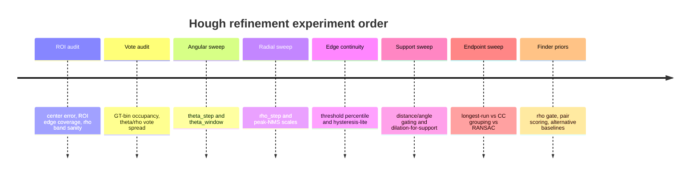

# Analytical report on Hough-based finder refinement failures

## Executive summary

Your evidence already separates the failure problem into four different stages, and they do **not** point to one single bug. The short-span failures A are primarily an **edge continuity** problem; your own control experiment with Canny removed A on `v12-default`, which is exactly what one would expect from adding hysteresis after non-maximum suppression. The missing-peak failures D are **not** primarily a threshold problem; lowering `threshold_rel` did not recover them, and your GT bins were empty, which points instead to vote fragmentation, wrong origin/ROI centering, or too-brittle one-bin voting. The long-span failures C are **not** primarily a TLS-refit problem; your measured TLS drift was only about `0.27°` mean and `<0.5°` max, so the overshoot is much more likely to come from contaminated support and endpoint extraction. The phantom failures B look partly **upstream of Hough**; all five phantoms occurred in a cluster ROI with no GT finder edge intersecting the ROI, so real QR data edges are being treated as candidate finder edges in the wrong box. fileciteturn0file0

That diagnosis matches the literature and library behavior. Canny’s NMS is the step that produces thin edges, while hysteresis is the step that preserves weak edge continuity only when connected to strong edges; this is exactly the mechanism that would remove your A-type fragmentation without broadening edges for Hough voting. Standard Hough voting is sensitive to discretization in \((\rho,\theta)\)-space, and standard peak extraction typically uses **separate** suppression scales in distance and angle rather than one monolithic notion of “best line.” Weighted Hough variants explicitly use edge intensity instead of binary votes, and probabilistic Hough variants shift attention from infinite lines to segments with explicit `line_length` and `line_gap` controls. citeturn4view0turn4view1turn9view1turn5view1

The most likely high-value changes are therefore: first, audit ROI centering and introduce a finder-specific \(\rho\)-gate tied to scale \(s\); second, replace one-bin voting by a small angular soft window; third, add a minimal hysteresis-lite edge linker or, at minimum, use dilation only for **support collection**, not for voting; fourth, replace “longest contiguous run” endpoint estimation with support grouping plus a segment labelling step. Those changes target D, A, C, and B respectively, instead of treating all failures as “Hough tuning.” fileciteturn0file0 citeturn4view0turn11view0turn5view1

If you only run eight experiments, the order should be: ROI-centering audit, vote-cloud audit, \(\theta\)-sweep, \(\rho\)-sweep, threshold/hysteresis sweep, support-gating sweep, endpoint-model sweep, and finder-specific quad scoring with an alternative baseline. The pass criteria should be recorded as: GT peak hit rate, peak SNR, support-length ratio, corner reprojection error, decode success if available, and runtime. fileciteturn0file0

## What the current evidence already says

The current implementation is very specific: Sobel + interpolated directional NMS, then one-theta gradient-guided Hough with `theta_step_deg=2`, `rho_step=1`, `threshold_rel=0.25`, `distance_thresh=1.5`, gap-based segment extraction, and TLS refit. The fixture baseline is also already specific enough to reason from: `v12-default` has `D=2, A=2, C=4, B=5`; `v12-clean` is perfect; `v5-default` has `D=2, A=1, C=3, B=0`. That structure matters: clean images are not the problem, but moderate blur/noise/perspective and ROI clutter are. fileciteturn0file0

Your own ablations already rule out several common explanations. Lowering `threshold_rel` did not recover D, which means “the right peak exists but is under threshold” is not the dominant failure mechanism for D. Rho-axis smoothing merged nearby parallel lines about `3 px` apart, which is exactly the finder-ring spacing regime you care about, so coarse smoothing is dangerous here. TLS drift was tiny in C failures, so the line orientation is mostly fine after refinement. Angle gating regressed clean images because inner and outer rings share the **same normal** but differ in \(\rho\), so angle-only gating cannot separate them. fileciteturn0file0

The Canny control is especially informative. In the OpenCV description, NMS gives thin edges, and hysteresis decides whether weak edge pixels survive based on connectivity to strong edges. In your fixture, Canny removed A failures on `v12-default` and did not regress `v12-clean`. That is a strong sign that the Sobel+NMS stage lacks enough connectivity logic for broken finder boundaries, even though it already localizes edges well. You do **not** need OpenCV in production to learn from this result; it is evidence that a small hysteresis-lite stage is worth implementing yourself. fileciteturn0file0 citeturn4view0

The phantom cluster C3 is also diagnostic. In your audit, C3 contains one finder pattern, but **zero GT edges intersect the ROI**, while the ROI still has strong QR data edges at similar orientations. This means at least some B failures are not “spurious votes from nowhere”; they are strong, real edges admitted by a box that is wrong for the question being asked. That elevates ROI centering and ROI extent from “maybe” to a first-class experimental variable. fileciteturn0file0

## Failure modes and their effect on votes and support

The table below lists the main failure modes I would consider, with the direct quantitative effect each has on the accumulator or support set.

| Failure mode | Mechanism | Expected effect on votes/support | Why it matches your evidence |
|---|---|---:|---|
| ROI center error | Coordinates are not centered on the true finder center | Shifts expected \(\rho\) by the center error projected onto line normal. A `5 px` center error means roughly a `5 px` \(\rho\)-error. | Explains why a finder-specific \(\rho \approx \pm s/2\) prior can fail if origin is wrong. Your current unknown ROI-centering is therefore critical. fileciteturn0file0 |
| Too-coarse \(\theta\) bins | Quantized normal misplaces votes across neighboring \(\rho\)-bins | For a segment half-length \(t\), \(\Delta \rho \approx t\,\Delta\theta\). At `t=30 px`, `5°` causes about `2.6 px` spread; `2°` causes about `1.0 px`. | D failures with empty GT bins are consistent with votes landing nearby but not in the GT bin. fileciteturn0file0 citeturn4view1 |
| One-bin voting too brittle | Each edge pixel votes to only one quantized \(\theta\) | If gradient directions vary by a few degrees under blur/noise, votes split instead of pooling, and true bins can be empty. | Exactly consistent with D staying unchanged when threshold was lowered. fileciteturn0file0 citeturn11view0 |
| Missing hysteresis / edge linking | NMS keeps local maxima but not weak connected continuation | Support becomes fragmented; short gaps break segment extent estimation. | Matches A, and Canny control removed A on `v12-default`. fileciteturn0file0 citeturn4view0 |
| Support distance gate too tight | True edge pixels drift > `1.5 px` from quantized line under blur/perspective | Support becomes shorter and less dense; endpoints become unstable. | Very plausible for A on noisy cases and for overshoot/undershoot if the accepted set is unbalanced. fileciteturn0file0 |
| Angle gate insufficient to separate rings | Inner and outer finder rings share the same normal | Angle filtering cannot distinguish them; only \(\rho\)-aware logic can. | Exactly what your reverted angle-gate experiment found. fileciteturn0file0 |
| Longest-run endpoint extraction | Chooses one support run without modeling adjacent structures | Either truncates across gaps or overshoots into nearby payload/ring edges. | Matches C, and TLS drift shows line orientation is not the main issue. fileciteturn0file0 |
| Peak suppression too wide | Nearby peaks in \(\rho\) or \(\theta\) are suppressed together | Parallel/adjacent finder boundaries can be merged or lost. | Your smoothing experiments already demonstrated that three-pixel-separated lines are delicate. Standard libraries explicitly expose separate angle and distance suppression scales for this reason. fileciteturn0file0 citeturn9view1 |
| ROI contains no target edge | Real data-region edges dominate a box that should not be scored as finder-boundary evidence | B failures with strong support and regular structure, not random noise. | Exactly your C3 phantom behavior. fileciteturn0file0 |
| Threshold-only tuning | Lower threshold adds more peaks without fixing vote location | More B; D unchanged if true bins are empty. | Exactly your threshold sweep result. fileciteturn0file0 |

The practical implication is simple. A is an **edge continuity** problem, D is a **vote localization** problem, C is a **support segmentation** problem, and B is at least partly an **ROI semantics** problem. That separation should govern the experiment order. fileciteturn0file0

## Diagnostics and visualizations to generate

The most useful diagnostics are the ones that distinguish “bad voting” from “bad support reconstruction.” For every matched GT edge, generate an accumulator heatmap in \((\theta,\rho)\) with three overlays: the GT bin, the nearest extracted peak, and the full vote cloud from only the support pixels that should belong to that edge. If the GT bin is empty but nearby bins are populated, the problem is vote spread; if the GT bin is strong but peak extraction misses it, the problem is peak NMS/thresholding. Standard Hough tooling and documentation make exactly this separation between transform formation and peak extraction. citeturn4view1turn9view1

For each extracted peak, generate a **per-peak support map** in image space: edge pixels colored by orthogonal distance to the refined line, with the refined infinite line clipped to the ROI border and the estimated segment endpoints marked. Also generate the 1D projection plot \(t\mapsto\) support density along the line direction. This is the fastest way to see whether C comes from true overshoot, bridge-through to another structure, or a bad longest-run rule. Your own TLS-drift result already suggests the problem is here, not in the angular fit. fileciteturn0file0

Generate an **edge-angle histogram** of NMS survivors, weighted by magnitude, per ROI. If the histogram is broad around each true normal, one-bin voting is too brittle; if it is tight, the problem is elsewhere. Complement this with a **rho-vs-theta scatter** for edge-pixel votes, either globally or restricted to GT-matched support, to see whether D failures are caused by wrong \(\theta\), wrong \(\rho\), or both. Gradient-orientation-aware Hough variants are specifically motivated by clutter reduction and peak sharpening in this regime. citeturn11view0

Finally, generate **ROI audit overlays**: cluster ROI, candidate center, GT finder center, expected outer-edge \(\rho=\pm s/2\) bands, and all Hough lines clipped to the ROI border. This will show immediately whether B is produced by ROIs that never should have been attempted, and whether a simple \(\rho\)-gate around \(\pm s/2\) could have rejected them. fileciteturn0file0

A minimal reporting bundle per experiment should therefore contain: accumulator heatmaps, per-peak support maps, ROI overlays, support-density plots, edge-angle histograms, and a CSV of all per-edge metrics. fileciteturn0file0

## Prioritized experiments

I recommend adding one deterministic harness wrapper, for example `python -m qr_reader.scripts.run_hough_ablation`, around the existing fixture logic in `test_hough_harness.py`. It should write one CSV row per parameter set and one diagnostics folder per case. The fixed cases should remain `v12-default`, `v12-clean`, and `v5-default`, exactly because they already separate noisy, clean, and smaller-version behavior. fileciteturn0file0

The CSV should record at least these metrics: `D,A,C,B`, GT peak hit rate, `peak_snr_mean`, `peak_snr_p05`, support-length ratio mean, support-length ratio p05, corner reprojection median and p95, decode success if available, runtime median and p95, plus counts of ROIs with zero GT edge intersection. fileciteturn0file0



The exact eight runs I would do first are these:

| Experiment | Exact command | What it isolates | Pass criterion |
|---|---|---|---|
| ROI audit | `python -m qr_reader.scripts.run_hough_ablation --cases v12-default,v12-clean,v5-default --mode roi_audit --seed 42 --out out/e1_roi_audit` | Whether B and D are actually ROI-origin problems | Median center error `<2 px`, p95 `<4 px`; zero-GT-edge ROIs explicitly flagged |
| Vote-cloud audit | `python -m qr_reader.scripts.run_hough_ablation --cases v12-default,v12-clean,v5-default --mode vote_audit --theta-step-deg 2 --theta-window-deg 0 --rho-step-px 1 --out out/e2_vote_audit` | Whether D is empty-GT-bin due to spread rather than threshold | For each D edge, diagnose as `theta_spread`, `rho_spread`, or `origin_shift`; no “unknown” cases |
| Angular sweep | `python -m qr_reader.scripts.run_hough_ablation --cases v12-default,v12-clean,v5-default --theta-step-deg 0.5,1,2,5 --theta-window-deg 0,1,3,6 --rho-step-px 1 --vote onebin,gaussian,dot --out out/e3_theta` | Vote brittleness | GT peak hit rate `+15%` on noisy cases without `>1` new B on clean case |
| Radial sweep | `python -m qr_reader.scripts.run_hough_ablation --cases v12-default,v12-clean,v5-default --theta-step-deg 1 --theta-window-deg 3 --rho-step-px 0.5,1,2 --peak-nms-theta 1,2,3 --peak-nms-rho 2,4,6 --acc-smooth none,1x3,1x5 --out out/e4_rho` | Peak extraction and neighboring-line separation | D decreases; no regression on clean case C by more than `+1` |
| Edge continuity sweep | `python -m qr_reader.scripts.run_hough_ablation --cases v12-default,v12-clean,v5-default --threshold-percentile 70,80,90,95 --hysteresis off,lite --out out/e5_edges` | Whether A is mostly missing connectivity | A reduced by at least `50%`; runtime increase `<20%` |
| Support sweep | `python -m qr_reader.scripts.run_hough_ablation --cases v12-default,v12-clean,v5-default --distance-threshold-px 1,2,3,5 --angle-threshold-deg 5,10,20 --support-dilate 0,1 --support-grouping none,cc --out out/e6_support` | Whether C/A come from support admission | Support-length ratio mean `>0.85`; C not worse than baseline |
| Endpoint-model sweep | `python -m qr_reader.scripts.run_hough_ablation --cases v12-default,v12-clean,v5-default --endpoint-model longest_run,cc_longest,ransac_segment --gap-tolerance-px 2,3,5 --out out/e7_endpoints` | Whether current longest-run model causes overshoot | Corner reprojection p95 `<3 px`; C reduced by at least `25%` |
| Finder-prior sweep | `python -m qr_reader.scripts.run_hough_ablation --cases v12-default,v12-clean,v5-default --rho-gate-frac 0.10,0.15,0.20,0.25 --quad-score basic,finder --baseline ppht,lsd --out out/e8_priors` | Whether B is reduced by geometry-aware selection | B near zero on noisy cases, no clean-case regression > `+1` |

The specific parameter sweeps you asked for are the right ones, and I would use them exactly in those experiments:

| Parameter | Sweep |
|---|---|
| `theta_step_deg` | `0.5, 1, 2, 5` |
| `theta_window_deg` | `0, ±1, ±3, ±6` |
| `rho_step_px` | `0.5, 1, 2` |
| accumulator smoothing | `none, 1x3 triangular, 1x5 triangular` |
| threshold percentile on NMS | `70, 80, 90, 95` |
| `distance_threshold_px` | `1, 2, 3, 5` |
| `angle_threshold_deg` | `5, 10, 20` |

The most important **pass/fail logic** is this. Experiments E1–E4 are successful if they improve **GT peak hit rate** and **peak SNR**. Experiments E5–E7 are successful if they improve **support-length ratio** and **corner error**. Experiment E8 is successful if it reduces **B** significantly without damaging `v12-clean`. That keeps the diagnostics aligned with the stage that is being changed. fileciteturn0file0

## Algorithmic changes and alternatives

The first change I would make is to replace one-bin voting with a **small angular soft vote**. Instead of sending each edge pixel to exactly one quantized \(\theta\), vote into a window around the local gradient-normal angle, using magnitude times an angular kernel. That is consistent with gradient-orientation-aware Hough variants, whose purpose is to reduce clutter and make true peaks more prominent. It also directly addresses your D evidence, because empty GT bins under one-bin voting are exactly what a soft angular window is supposed to fix. citeturn11view0 fileciteturn0file0

A practical NumPy idiom for that path is:

```python
theta_idx = base_idx[:, None] + offsets[None, :]
flat = theta_idx * n_rho + rho_idx
acc = np.bincount(flat[valid].ravel(),
                  weights=w[valid].ravel(),
                  minlength=n_theta * n_rho).reshape(n_theta, n_rho)
```

Use `np.bincount`, not `np.add.at`, precompute `cos(theta)`/`sin(theta)` tables once, and flatten the 2D indices. The complexity is then \(O(E \cdot K)\), where \(E\) is surviving edge pixels and \(K\) is the half-window size plus one; one-bin voting is \(O(E)\), and standard full-angle Hough is \(O(E \cdot N_\theta)\). The Hough literature consistently notes that storage and computation are key constraints, so keeping \(K\) small is the right engineering trade-off. citeturn12view0

The second change is a **minimal hysteresis-lite** stage, implemented entirely by you. Keep your existing Sobel + interpolated NMS, then threshold at a high percentile and a lower percentile, and run an 8-connected flood from strong to weak pixels. OpenCV’s description is explicit that hysteresis exists to keep weak pixels only when they connect to strong edges, and your own Canny control shows that this specifically fixes A without harming clean images. If you do not want hysteresis in voting, use it only to create a support mask; vote from the thin NMS image, but collect support from the linked edge mask. citeturn4view0 fileciteturn0file0

The third change is in **post-Hough support reconstruction**. Right now support is admitted by distance-to-line and then reduced to a longest contiguous run. That is cheap, but your C failures strongly suggest that the support set contains the wrong pixels even when the line fit is good. I would test three alternatives. The mildest is dilation-then-support: dilate the NMS edge mask by one pixel **only for support collection**, never for voting. The next is connected-component grouping within the support set, after projecting support points to the line coordinate \(t\). The strongest is a RANSAC-on-support segment estimator, where the model is still a line but the inlier set is constrained in both orthogonal distance and \(t\)-contiguity. These are all standard robust-fitting ideas; scikit-image exposes both TLS line models and RANSAC because the two solve different problems when outliers are present. citeturn8view0

The fourth change is a **finder-specific prior layer**. You already know approximate finder scale \(s\). Once coordinates are centered correctly, the outer finder boundary should sit near \(|\rho| \approx s/2\). That means you should score or gate lines by something like
\[
\left|\,|\rho| - \frac{s}{2}\right| < \tau_\rho,
\]
with \(\tau_\rho\) swept over `0.10s, 0.15s, 0.20s, 0.25s`. Then select quads using two near-parallel pairs, near-orthogonal adjacent pairs, center containment, and endpoint-intersection consistency. This is the natural fix for B and for angle-gate failure: same-normal inner and outer rings are distinguished by \(\rho\), not by \(\theta\). fileciteturn0file0

A concrete quad score can be:

\[
S = 2.0\,z_{\text{support}} + 1.5\,z_{\rho} + 1.0\,z_{\parallel} + 1.0\,z_{\perp} + 1.0\,I_{\text{contains center}} - 1.5\,z_{\text{overshoot}} - 2.0\,I_{\text{ROI has zero GT-band overlap}}
\]

where \(z_\rho\) is higher when \(|\,|\rho|-s/2|\) is small, \(z_{\parallel}\) rewards opposite-pair parallelism, and \(z_{\text{overshoot}}\) grows when line intersections lie outside both support spans. Those weights are only a start, but they are a useful first deterministic baseline.

For alternative algorithms, two are genuinely worth trying. The first is **progressive probabilistic Hough** as a control baseline: it explicitly returns segments and exposes `line_length` and `line_gap`, which map closely to your A and C failure modes. The second is **LSD**, which is linear-time, subpixel-accurate, and designed to control false detections. In your context I would not treat either as immediate production replacements; I would treat them as “oracles” to tell you whether your main issue is Hough voting or segment extraction. citeturn5view1turn5view2turn5view3

For voting variants, I would only keep four on the table:

| Voting scheme | Recommendation | Reason |
|---|---|---|
| One-bin | Keep as baseline | Cheap, good control |
| Gaussian angular window | Highest priority | Direct fix for D-type vote fragmentation |
| Soft vote via dot product | High priority | Avoids hard `atan2` dependence; use \(w=s\cdot\max(0,n_\theta\cdot \hat g)^p\) |
| Complex-valued accumulator | Experimental only | Promising as an engineering trick to penalize inconsistent local orientation, but not necessary first |

The most important thing is that the next phase stays **deterministic**. Progressive probabilistic methods and RANSAC can still be deterministic if seeded. The scikit-image probabilistic Hough documentation exposes an explicit RNG parameter for exactly this reason. citeturn5view1

In short, I would not spend more time on pure threshold tweaks or accumulator smoothing. Your own evidence already shows those are low-yield. I would spend the next week on origin/ROI audit, soft angular voting, hysteresis-lite support linking, and support segmentation. Those are the four changes most directly supported by the current failure catalogue. fileciteturn0file0